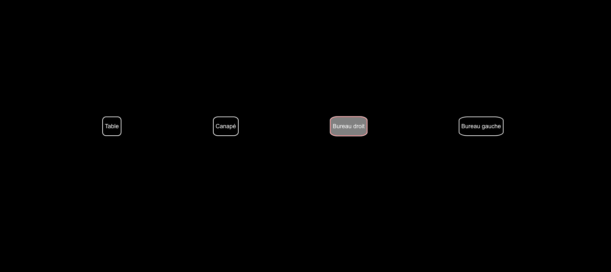

# MagicMirror2 Module: MMM-Hue-Controller-2

```bash

  __  __ __  __ __  __        _    _                    _____            _             _ _                ___
 |  \/  |  \/  |  \/  |      | |  | |                  / ____|          | |           | | |              |__ \
 | \  / | \  / | \  / |______| |__| |_   _  ___ ______| |     ___  _ __ | |_ _ __ ___ | | | ___ _ __ ______ ) |
 | |\/| | |\/| | |\/| |______|  __  | | | |/ _ \______| |    / _ \| '_ \| __| '__/ _ \| | |/ _ \ '__|______/ /
 | |  | | |  | | |  | |      | |  | | |_| |  __/      | |___| (_) | | | | |_| | | (_) | | |  __/ |        / /_
 |_|  |_|_|  |_|_|  |_|      |_|  |_|\__,_|\___|       \_____\___/|_| |_|\__|_|  \___/|_|_|\___|_|       |____|


```

## Description

This project is a fork from [MMM-Hue-Controller](https://github.com/gueguet/MMM-Hue-Controller) !



## Feature

-   [x] List all light with button
-   [x] Interaction with light (ON / OFF) from a button
-   [ ] Interaction with lights from an event / notification from another MagicMirror2 module
-   [ ] Change the brightness
-   [ ] Set color
-   [ ] Set theme

## Table of contents

-   [Prerequisites](#prerequisites)
-   [Installation](#installation)
    -   [Using the module](#using-the-module)

### Prerequisites

This module will use the Philips Hue API : https://developers.meethue.com/

You basically need three things to make the module working :

-   The IP address of your Philips Hue Bridge
    _You can get it with Angry IP Scanner to retrieve it for instance_
-   An authorized username to use the API, follow instructions here : https://developers.meethue.com/develop/get-started-2/
    _This username is permanent so no need to refresh it or whatever_

## Installation

Inside your modules folder, execute :

```bash

$ git clone https://github.com/jboucly/MMM-Hue-Controller-2

$ cd MMM-Hue-Controller-2

$ npm install # Install dependencies
```

## Using the module

In the `config/config.js` file, just add this to the `modules` array :

```js
{
    module: "MMM-Hue-Controller-2",
    position: "top_right",
    config: {
        bridgeIp: "<IP_OF_YOUR_HUE_BRIDGE>",
        user: "<AUTHORIZED_USER>",
    }
},
```
