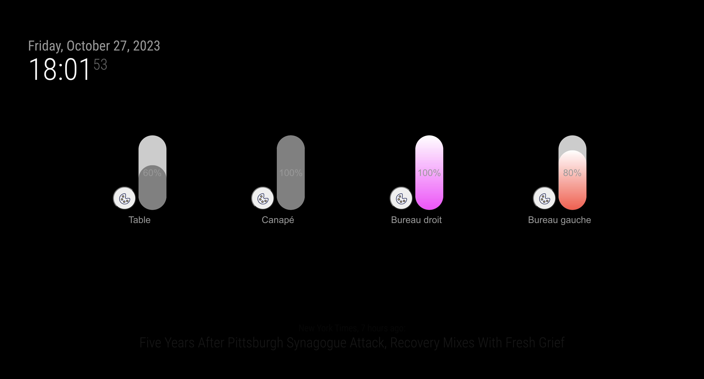

# MagicMirror2 Module: MMM-Hue-Controller-2

```bash

  __  __ __  __ __  __        _    _                    _____            _             _ _                ___
 |  \/  |  \/  |  \/  |      | |  | |                  / ____|          | |           | | |              |__ \
 | \  / | \  / | \  / |______| |__| |_   _  ___ ______| |     ___  _ __ | |_ _ __ ___ | | | ___ _ __ ______ ) |
 | |\/| | |\/| | |\/| |______|  __  | | | |/ _ \______| |    / _ \| '_ \| __| '__/ _ \| | |/ _ \ '__|______/ /
 | |  | | |  | | |  | |      | |  | | |_| |  __/      | |___| (_) | | | | |_| | | (_) | | |  __/ |        / /_
 |_|  |_|_|  |_|_|  |_|      |_|  |_|\__,_|\___|       \_____\___/|_| |_|\__|_|  \___/|_|_|\___|_|       |____|


```

## Description

Control your Philips Hue lights from your MagicMirror ! Change color, brightness, turn on/off, etc.
This project is a fork from [MMM-Hue-Controller](https://github.com/gueguet/MMM-Hue-Controller).




## Features

-   [x] List all light with button
-   [x] Interaction with light (ON / OFF) from a slider / button
-   [x] Interaction with lights from an event / notification from another MagicMirror2 module
-   [x] Change the brightness
-   [x] Set color
-   [ ] Set theme

## Table of contents

-   [Prerequisites](#prerequisites)
-   [Installation](#installation)
    -   [Using the module](#using-the-module)

### Prerequisites

This module will use the Philips Hue API : https://developers.meethue.com/

You basically need three things to make the module working :

-   The IP address of your Philips Hue Bridge
    _You can get it with Angry IP Scanner to retrieve it for instance_
-   An authorized username to use the API, follow instructions here : https://developers.meethue.com/develop/get-started-2/
    _This username is permanent so no need to refresh it or whatever_

## Installation

Open your terminal in your MagicMirror project and ⤵️

1. Go to your MagicMirror's **module folder**:

```sh
$ cd ~/MagicMirror/modules
```

2. Clone this module

```sh
$ git clone https://github.com/jboucly/MMM-Hue-Controller-2
```

3. Go to directory of this module

```sh
$ cd MMM-Hue-Controller-2
```

4. Install dependencies

```sh
$ npm ci
```

5. Configure the module in the `config.js` file.

## Using the module

In the `config/config.js` file, just add this to the `modules` array :

```js
{
    module: "MMM-Hue-Controller-2",
    position: "top_right",
    config: {
        bridgeIp: "<IP_OF_YOUR_HUE_BRIDGE>",
        user: "<AUTHORIZED_USER>",
        colors: ['#FF0000', '#00FF00', '#0000FF', ...],
    }
},
```

## Configuration options

The following properties can be configured :
| Options | Required | Default | Description |
|---------- |---------- |------------------------------------------------------------------------------------------------------------------------------------------------------------------------------------------------------------------------------------------------- |----------------------------------------------------------------------------------------------------- |
| bridgeIp | true | null | Ip address of your hue bridge. Ex : 192.168.1.29 |
| user | true | null | User authorized to call bridge. Ex : syRTYmVVwF |
| colors | false | #FF0000 // Red<br>#00FF00 // Green<br>#0000FF // Blue<br>#FFFF00 // Yellow<br>#00FFFF // Cyan<br>#FF00FF // Magenta<br>#FFFFFF // White<br>#FFA500 // Orange<br>#FF1493 // Pink<br>#8A2BE2 // Purple<br>#40E0D0 // Turquoise<br>#FFD700 // Gold | This corresponds to the color list you want to have in the color selection settings for your lights |

## Notifications

You can interact with the module, it has several notification points :

**Send notification :**

-   `HUE_GET_ALL_LIGHTS` : Request to receive all lights from the bridge
-   `HUE_TURN_ON_LIGHT` : Turn on a light, pass id in payload
-   `HUE_TURN_OFF_LIGHT` : Turn off a light, pass id in payload
-   `HUE_CHANGE_BRIGHTNESS` : Set brightness of a light, pass id and brightness in payload
-   `HUE_CHANGE_COLOR` : Set color of a light, pass id and hexadecimal color in payload

⚠️ `HUE_CHANGE_BRIGHTNESS` and `HUE_CHANGE_COLOR` switch on the light if it is off.

Example :

```javascript
this.sendNotification('HUE_TURN_ON_LIGHT', '1');
// or
this.sendNotification('HUE_CHANGE_COLOR', { id: '1', color: '#FF0000' });
```

**Received notification :**

-   `HUE_LIGHTS_LIST` : Received all lights from the bridge.

Payload :

```javascript
{
  id: '1',
  on: true,
  name: 'Light 1',
  brightness: 254, // 0 to 254
  type: 'color', // color | white
  color: '#FF0000', // Hexadecimal color
}
```
